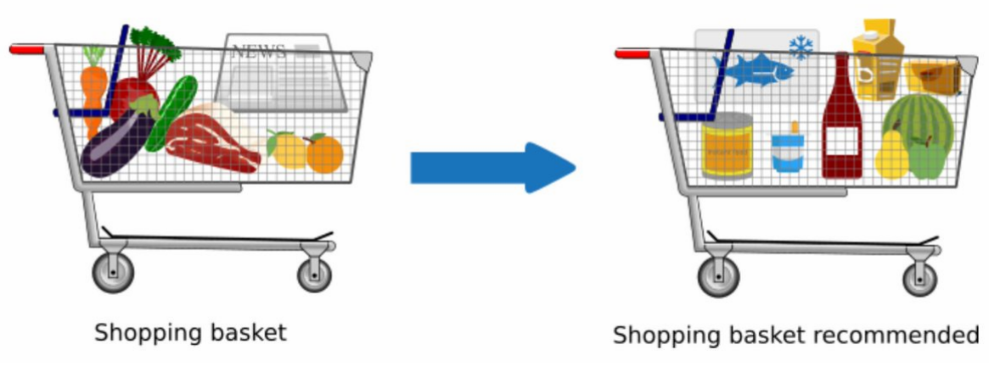

# Market Basket Analysis
 

## What's Market Basket Analysis(MBA)

Market basket analysis is one of the key techniques used by retailers to increase sales by better understanding customer purchasing patterns. It involves analyzing large data sets, such as purchase history, to reveal product groupings, as well as products that are likely to be purchased together. It works by looking for combinations of items that occur together frequently in transactions. Association Rules are widely used to analyze retail basket or transaction data, and are intended to identify strong rules discovered in transaction data using measures of interestingness, based on the concept of strong rules.

## Types of market basket analysis

There are two types of market basket analysis:

- Predictive market basket analysis: This type considers items purchased in sequence to determine cross-sell

- Differential market basket analysis: This type considers data across different stores, as well as purchases from different customer groups during different times of the day, month or year. If a rule holds in one dimension (like store, time period or customer group), but does not hold in the others, analysts can determine the factors responsible for the exception. These insights can lead to new product offers that drive higher sales.

## Algorithms associated with market basket analysis

In market basket analysis, association rules are used to predict the likelihood of products being purchased together. Association rules count the frequency of items that occur together, seeking to find associations that occur far more often than expected.

Algorithms that use association rules include AIS, SETM and Apriori. The Apriori algorithm is commonly cited by data scientists in research articles about market basket analysis and is used to identify frequent items in the database, then evaluate their frequency as the datasets are expanded to larger sizes.

## Examples of market basket analysis

The Amazon website employs a well-known example of market basket analysis. On a product page, Amazon presents users with related products, under the headings of “Frequently bought together” and “Customers who bought this item also bought.”

Market basket analysis also applies to [bricks-and-mortar](https://searchcio.techtarget.com/definition/bricks-and-mortar) stores. If analysis showed that magazine purchases often include the purchase of a bookmark (which could be considered an unexpected combination, since the consumer did not purchase a book), then the book store might place a selection of bookmarks near the magazine rack.

## Association Rule Mining

Association rules can be thought of as an IF-THEN relationship. Suppose item **A** is being bought by the customer, then the chances of item **B** being picked by the customer too under the same **Transaction ID** is found out.

 

**There are two elements of these rules:**

**Antecedent (IF)**: This is an item/group of items that are typically found in the Itemsets or Datasets.

**Consequent (THEN)**: This comes along as an item with an Antecedent/group of Antecedents.

But here comes a constraint. Suppose you made a rule about an item, you still have around 9999 items to consider for rule-making. This is where the Apriori Algorithm comes into play. So before we understand the Apriori Algorithm, let’s understand the math behind it. There are 3 ways to measure association:

- Support
- Confidence
- Lift
 

**Support:** It gives the fraction of transactions which contains item A and B. Basically Support tells us about the frequently bought items or the combination of items bought frequently.

So with this, we can **filter out** the items that have a **low frequency**.

 

**Confidence:** It tells us how often the items A and B occur together, given the number times A occurs.

 

Typically, when you work with the Apriori Algorithm, you define these terms accordingly. **But how do you decide the value?** Honestly, there isn’t a way to define these terms. Suppose you’ve assigned the support value as 2. What this means is, until and unless the item/s frequency is not 2%, you will not consider that item/s for the Apriori algorithm. This makes sense as considering items that are bought less frequently is a waste of time.

 

Now suppose, after filtering you still have around 5000 items left. Creating association rules for them is a practically impossible task for anyone. This is where the concept of lift comes into play.

 

**Lift:** Lift indicates the strength of a rule over the random occurrence of A and B. It basically tells us the strength of any rule.

 

Focus on the denominator, it is the probability of the individual support values of A and B and not together. Lift explains the strength of a rule. **More the Lift more is the strength.** Let’s say for A -> B, the lift value is 4. It means that if you buy A the chances of buying B is 4 times.

## An example of Association Rules

- Assume there are 100 customers
- 10 of them bought milk, 8 bought butter and 6 bought both of them.
- bought milk => bought butter
- support = P(Milk & Butter) = 6/100 = 0.06
- confidence = support/P(Butter) = 0.06/0.08 = 0.75
- lift = confidence/P(Milk) = 0.75/0.10 = 7.5

## Apriori Algorithm

**[Explaination of the algorithm](https://www.javatpoint.com/apriori-algorithm-in-machine-learning)**

## Benefits of market basket analysis

Market basket analysis can increase sales and customer satisfaction. Using data to determine that products are often purchased together, retailers can optimize product placement, offer special deals and create new product bundles to encourage further sales of these combinations.

These improvements can generate additional sales for the retailer, while making the shopping experience more productive and valuable for customers. By using market basket analysis, customers may feel a stronger sentiment or brand loyalty toward the company.

